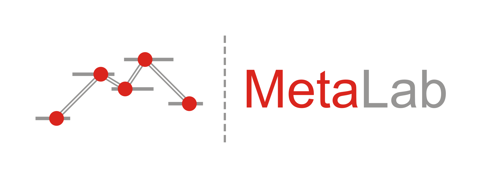



::: {.metalab-hero}
::: {.hero-left}

{alt="MetaLab" style="max-width: 420px; width: 100%;"}

[Interactive, community-augmented meta-analysis tools for cognitive development research]{.tagline}

<p style="margin-top: 1.25rem;">
<a class="btn btn-primary" href="explorer.qmd">Explore the data</a>
<a class="btn btn-outline-primary" href="datasets.qmd">Browse datasets</a>
<a class="btn btn-outline-primary" href="about.qmd">Documentation</a>
</p>

New MetaLab user? Check out [About](about.qmd) first!

:::
::: {.hero-right}

```{ojs hero-stats}
stats = d3.json("slices/stats.json")

html`<p>The MetaLab database contains
<span class="stat-strong">${stats.n_effect_sizes.toLocaleString()} effect sizes</span>
from <span class="stat-strong">${stats.n_datasets} meta-analyses</span> across
two domains of cognitive development, based on data from
<span class="stat-strong">${stats.n_papers.toLocaleString()} papers</span> and
<span class="stat-strong">${stats.n_subjects.toLocaleString()} subjects</span>.</p>
<p style="font-size: 0.85rem; color: #777;">Data release ${stats.source_release}
· <a href="https://stanford.redivis.com/datasets/81tq-8dp5ge6b9">versioned archive on Redivis</a></p>`
```

```{ojs hero-funnel}
hero_funnel = {
  // live funnel plot (IDS preference, Hedges' g) -- the legacy home page
  // showed a static image of this plot; here it is computed from the
  // current release
  const rows = await d3.json("slices/es/idspref.json");
  clear_loading();
  const pts = rows
    .map((d) => ({ es: +d.g_calc, se: Math.sqrt(+d.g_var_calc) }))
    .filter((d) => Number.isFinite(d.es) && Number.isFinite(d.se));
  const center = d3.mean(pts, (d) => d.es);
  const L = 1.05 * d3.max(pts, (d) => d.se);
  const grid = d3.range(0, L * 1.0001, L / 50);
  const tri95 = grid.map((s) => ({ se: s, x1: center - 1.96 * s, x2: center + 1.96 * s }));
  const tri99 = grid.map((s) => ({ se: s, x1: center - 2.576 * s, x2: center + 2.576 * s }));
  const xmin = Math.min(center - 2.576 * L, d3.min(pts, (d) => d.es));
  const xmax = Math.max(center + 2.576 * L, d3.max(pts, (d) => d.es));
  return html`<div style="margin-top: 0.5rem;">
    <div style="font-size: 0.85rem; color: #444; margin-bottom: 0.2rem;">
      <b>Funnel plot</b> of bias in effect sizes
      <span style="color:#999;">(infant-directed speech preference — live)</span></div>
    ${Plot.plot({
      width: 460, height: 280,
      marginLeft: 45,
      x: { label: "Effect size", domain: [xmin, xmax] },
      y: { label: "Standard error", domain: [0, L], reverse: true },
      marks: [
        Plot.rect([{}], { x1: xmin, x2: xmax, y1: 0, y2: L, fill: "#e6e6e6" }),
        Plot.areaX(tri99, { y: "se", x1: "x1", x2: "x2", fill: "#fff", fillOpacity: 0.5 }),
        Plot.areaX(tri95, { y: "se", x1: "x1", x2: "x2", fill: "#fff", fillOpacity: 0.5 }),
        Plot.ruleX([center], { strokeDasharray: "2,2", stroke: "#333" }),
        Plot.dot(pts, { x: "es", y: "se", fill: "#268bd2", fillOpacity: 0.7, r: 3 })
      ]
    })}</div>`;
}
```

:::
:::

## What is MetaLab?

MetaLab is a collection of community-augmented meta-analyses of language
acquisition and cognitive development. Anyone can use the data to explore
phenomena in early development, plan a study with meta-analytically grounded
power analyses, or contribute new effect sizes to a growing, curated database.

Two papers are the best introduction to the project. **[Bergmann et al.
(2018)](https://doi.org/10.1111/cdev.13079)** describes the database and uses
it to diagnose the field's statistical power and methodological choices — see
the live [Replicability](replicability.qmd) analyses. **[Cao et al.
(2025)](https://doi.org/10.1111/desc.70028)** asks how effect sizes change
over development across 25 datasets — see [Age Curves](age-curves.qmd). New
to meta-analysis? Start with the [primer](about.qmd#a-short-meta-analysis-primer).

::: {.grid}

::: {.g-col-12 .g-col-md-4}
### Explore
Interactive [visualizations](explorer.qmd) of every dataset: effect sizes
across age, funnel plots, forest plots, and moderator analyses — plus
[analyses](age-curves.qmd) of what the whole database says about development.
:::

::: {.g-col-12 .g-col-md-4}
### Plan
Meta-analytic [power analysis](power-analysis.qmd): how many participants do
you need, given everything the literature already knows about your effect?
:::

::: {.g-col-12 .g-col-md-4}
### Contribute
Add new effect sizes or datasets — see [About](about.qmd) and the dataset
[validator](validator.qmd).
:::

:::
